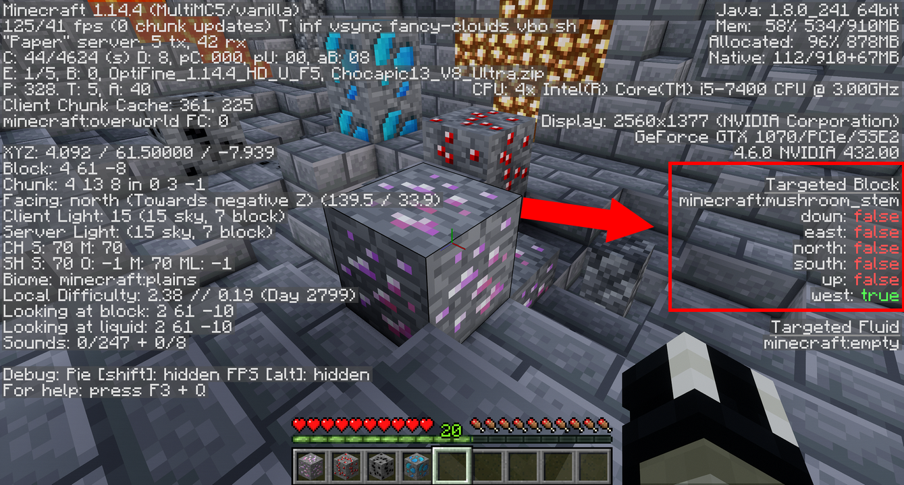

# World Generators

Oraxen doesn't natively support ores generation, instead you can use world generators like [IrisWorldGenerator](iris-world-generator.md), [EpicWorldGenerator ](https://www.spigotmc.org/resources/epicworldgenerator-1-14-1-15-2-support-all-update-aquatic-features.8067/)or [RealisticWorldGenerator](https://www.spigotmc.org/resources/realisticworldgenerator-1-8-8-1-16-x.15905/).&#x20;

## Find your ores' custom block data

For most custom world generators you need to find your custom block data. This can be achieved using any minecraft version on a server running Oraxen. Just place your block (you can get it from the oraxen inventory of give it to yourself through a command) and press F3 while looking at the block you want to add.

### For note\_block based blocks (default)

.png>)

### For mushroom based blocks

