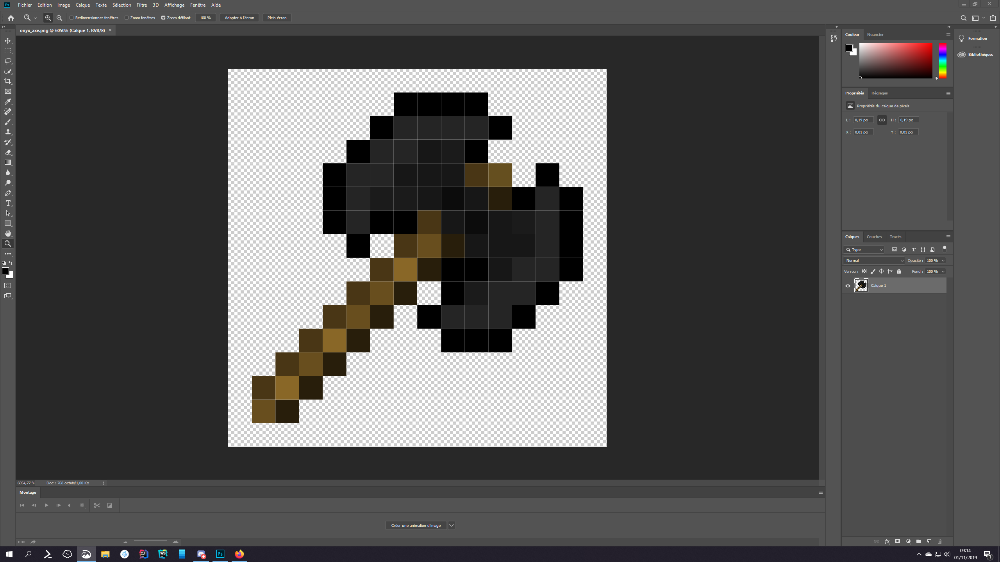

# Items (beginners)

Today I want to create a new super rare object. By the way, it's funny how players love having super rare items, so to make them happy they all end up having a super rare item (having a rare item is no longer very rare lol). No more jokes, let's get to work! This tutorial will explain how to create an onyx axe but you can do absolutely anything you want with it.

## 1. Let's start by creating textures

For this tutorial I will make a simple item in 2d and Oraxen will generate the model, but if you want you can use software like [cubik.studio](https://cubik.studio) (paid) or [blockbench](https://www.blockbench.net) (free + opensource) which are both excellent.

Here's what I did in 16x16 (so it still looks like vanilla minecraft) on Photoshop:



I then save the file under the name _onyx\_axe.png_.

## 2. The basic configuration

I couldn't decide where to add my axe (is it more of a tool or a weapon?) so I created my **super\_cool\_items.yml** file under items directory. Here is what I wrote:

```yaml
onyx_axe:
  displayname: "<#6f737d>Onyx Axe"
  material: DIAMOND_AXE
```

So I put a name to my item and chose to use the diamond axe as a base. In the [advanced tutorial](items-advanced/) you will see many other possibilities of additional modifications (like how to use enchantments, itemflags, attributes, etc).

## 3. Let's assign the texture to the item

Normally you would have had to create two json files: one explaining how to display the texture and another explaining when to do it (it would be a shame if all diamond axes took the new texture), with Oraxen it is not necessary, we just have to specify the different layers of textures we want to add to our item (generally there is only one but there can be more on items that can be colored like leather armors for example). Here is what I wrote:

```yaml
onyx_axe:
  displayname: "&0Onyx Axe"
  material: DIAMOND_AXE
  Pack:
    generate_model: true
    parent_model: "item/handheld"
    textures:
      - onyx_axe.png
```

As you can see I've set parent\_model to "item/handheld", it is the parent model used by tools while the one used by stuff like diamonds for example is "item/generated", this is what defines how the item appears in the hand (if you don't do this your weapon may be held weridly).

I also need to drag my **onyx\_axe.png** texture into the **/pack/textures** folder of Oraxen. From this configuration I could normally already restart the server and see my item but I want to add cool powers to it.


You can also use a json model to create 3d items, [here is a link](items-advanced/#use-a-json-model) to the documentation.


## 4. Let's improve our item with mechanics

In the configuration of each item you can add a mechanics section and add lots of cool things in it. By the way, if you find that there are not enough cool features (although I try to add as many as possible) you can add some via other plugins that use Oraxen's api (see [Create your own Mechanic](../developers/mechanics.md)). I would like my axe to have a huge durability and to be able to break bedrock. Here is what I wrote:

```yaml
onyx_axe:
  displayname: "&0Onyx Axe"
  material: DIAMOND_AXE
  Pack:
    generate_model: true
    parent_model: "item/handheld"
    textures:
      - onyx_axe.png
  Mechanics:
    durability:
      value: 20000
    bedrockbreak:
      delay: 0
      period: 10
      probability: 0.5
```

A durability of 20,000 is ludicrous, to compare diamond tools have a 1,561 one. I put a probability of 0.5 for loot when you mine the bedrock with it because I want the bedrock block to remain difficult to obtain.


For some mechanics it is necessary to use ProtocolLib, this is the case for bedrockbreak


## 5. Let's try it!

I begin by restarting the server and when it is good I will install the texture pack.zip pack generated in the /pack/ folder of Oraxen.

I give myself the axe from the inventory via /o inv and this is what I get:


I'm also able to mine bedrock:



If you have come this far, congratulations you have created your own item 👍

