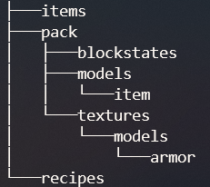

# Understand the basics

As you have seen previously, Oraxen is able to generate custom items but also the texture pack that goes with them. It also makes it possible to associate these items with special powers or capabilities known as mechanics.

## Content of the Oraxen folder



### Global configurations

At root of this configuration folder you'll find two files: settings.yml which contains various settings for Oraxen and mechanics.yml which contains global mechanics settings.

### Items configurations

The subfolder items contains all your created items. You can create a new item in any files and even create new files or remove existing ones: you can also do everything in a single file, but being able to store them in folders with explicit names should help you organize yourself.

### Resourcepack

The resource pack is a crucial element of oraxen and even if it is able to generate most of the files you will need, you will still have to provide the textures of the custom items yourself, all this is managed inside the Pack folder. You'll use the **textures** subfolder for adding textures and the **models** subfolder for adding models \(if you want to use 3d items for example\). You can also change the basic files of the pack \(pack.mcmeta, pack icon, etc.\) from the root of the pack folder. If you need to override a specific file from the pack, you can create an assets folder and put for example **assets/minecraft/sounds.json**.

### Recipes

This folder contains the configurations of the different recipes you have added sorted by recipe type. For example, shaped.yml will contain all your shaped recipes. You will rarely use this folder because it is easier and faster to generate this configuration directly from the game via the oraxen recipe commands.

## Configuration generalities

It will sometimes be specified that color codes can be used, this means that you can use the character & followed by a character that matches the desired color or effect:

```text
# 0 black         # f white
# 1 dark_blue     # 9 blue
# 2 dark_green    # a green
# 3 dark_aqua     # b aqua
# 4 dark_red      # c red
# 5 dark_purple   # d light_purple (pink)
# 6 gold          # e yellow
# 7 gray
# 8 dark_gray
```

