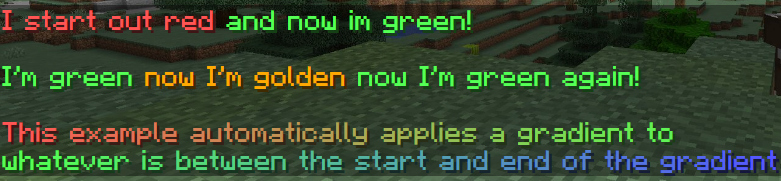

# Understand the basics

As seen previously, Oraxen is able to generate custom items including the texture pack that goes with them.
It also makes it possible to associate these items with special powers or capabilities known as mechanics.

## Color and other minecraft formatting

Minecraft only supported 16 colors in the past and most plugins used a special format with the & character. However, 1.16 added hex coloring for text and given the amount of formatting possible (clickable messages for example). Since PaperMC supports the [MiniMessage format](https://docs.adventure.kyori.net/minimessage.html#format). You are able to use hex coloring for items as well as some other additional tricks. If you'd like to try out minimessage formatting, [click here](https://webui.advntr.dev/)!

Examples:
* Hex Colors - `<#FF5555>I start out red <#55FF55>and now im green!`
* Simple Colors - `<green>I'm green <gold>now I'm golden</gold> now I'm green again!`
* Auto Gradient - `<gradient:red:green:blue>This example automatically applies a gradient to whatever is between the start and end of the gradient</gradient>`

## Content of the Oraxen folder

### Global configurations

At root of this configuration folder you'll find two files:
settings.yml which contains various settings for Oraxen and mechanics.yml which contains global mechanics settings.

### Items configurations

The subfolder `Oraxen/items` contains all created/purchased item configurations. You may make a new file for any item(s) you'd like or remove existing ones. While everything can be in a single file, storing them in folders with explicit names should help keep things organized

### Resourcepack

The resource pack is a crucial element of oraxen and even if it is able to generate most of the files you will need,
you will still have to provide the textures of the custom items yourself, all this is managed inside the `Oraxen/pack` folder.

You can use the `Oraxen/pack/textures` subfolder for adding textures and the `Oraxen/pack/models` subfolder for adding models (if you want to use 3d items for example).
You can also change the basic files of the pack (pack.mcmeta, pack icon, etc.) from the `Oraxen/pack` folder itself.

If you need to override a specific file from oraxen, you can create the `Oraxen/pack/assets` folder and insert for example `assets/minecraft/sounds.json` to override that file if generated by oraxen.

### Recipes

This folder contains the different recipe configurations you have added which are sorted by recipe type.
For example, `Oraxen/recipes/shaped.yml` will contain all shaped recipes while `Oraxen/recipes/campfire.yml` will have any campfire recipes.

*This folder is rarely touched because it is easier/faster to generate recipe configs directly from the game via the [oraxen recipe command](https://docs.oraxen.com/usage/commands#manage-recipes).*
