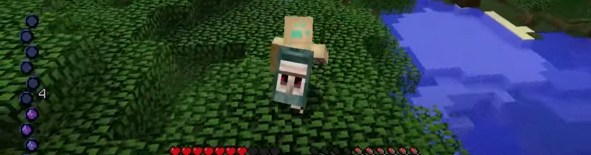
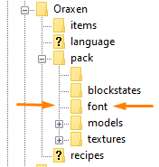
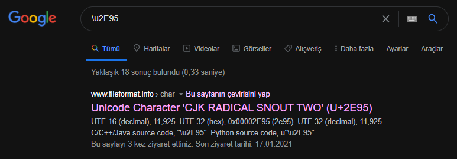
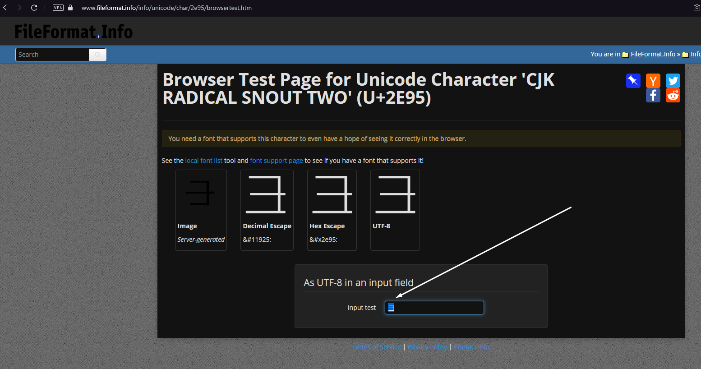
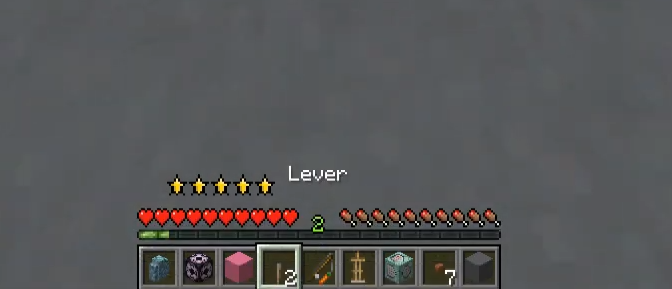

# Custom HUDs

## About the writer

I'm **kedybogan**_\(kedy boğan\),_ an helper on the Oraxen discord and a contributor of the wiki. It's my first article, so if you notice any problem, please contact me and tell me how I can improve it! Here is my discord: **kedy boğan\#6929**

## What is it about?

 I'll teach you how to add custom HUDs into the Minecraft via Oraxen. I hope this will be helpful!



## How does it work?

It works as **textured unusual unicodes in actionbar**. There are tens of thousands of unicodes that exist but few are used. Unicodes will very useful with Oraxen to create HUD. You can add/make many different things too with unicodes but It's not the topic for now...

## Let's start with preparing folders and files!

We will need a new folder and a file that not included in default config but don't worry I will give all of these with cool tips!

### Font folder



If Its name won't be **font** it will **not** work. Also file location is too important too. Please do what i do as same _don't try to be different cool guy. I was..._

## Most important one! default.json



As you can see in the title It's the most important one. **default.json** provides unicodes work. I guess you don't have that file yet. Don't worry! :\) I putted the file just download and **put it in font folder**.

I left 2 unicode samples into default.json you can add more and more! And you can change their height and ascent as how do you want to but It's already fit to upper of hunger/health bar If you use it in **actionbar.** I want to leave the config as code text for you:

```javascript
{
    "providers": [
        {
            "type": "bitmap",
            "file": "emptymana.png",
            "ascent": -10,
            "height": 10,
            "chars": ["\u2E95"]
        },
        {
            "type": "bitmap",
            "file": "fullmana.png",
            "ascent": -10,
            "height": 10,
            "chars": ["\u2EB1"]
        }

    ]
}
```

## "File": "x.png"

"file" mustn't include location, just type the texture name so emptymana.png instead of textures/emptymana.png, It's the biggest issue while configurating it... You should think easy because Oraxen is easy to use! :\)

## Finding the unicode\("chars": \[\u2E95"\]\)

It's the easiest one! Just copy the **\e2E95** part and **google it**!





Yes now you need the copy/get unicode as symbol. Yes I know looks weird and chinese. But don't worry It will be most mana thing ever in game! _By the way don't lose your unicode symbol!_

## Find a any actionbar plugin that support PlaceHolderAPI 

Unfortunetly I can't recommend any plugin for now... But I believe you can find easily _or code it?_

## It's added in game!

Actually you have to understand how it works actually. Think it as just a actionbar with Text and placeholder. For example: Mana: 200. That's it don't think it as cool HUD just text and placeholder. But we won't use text. We'll use _mana textured_ unicode symbol instead of mana text.

For my sample type it to action bar: 

⺕ %placeholder\_mana%

 \(Enter valid placeholder to work. That placeholder is just a sample to understand\)

## Do you want to it in upper hungerbar?

Your hud will be in middle of hunger and health bar. That might be not cool so much...

Add many spaces unicode's behind so I guess you don't understand 

Here is a example:   actionbar: "                              ⺕"\(until fits upper hungerbar\) instead of actionbar: "⺕"

## Do you want to it in upper healthbar?

Actually hungerbar is cool enough and healthbar is really too harder than hungerbar. That needs negative spaces fonts. Negative spaces pushes back the text. I won't show it for now. But maybe soon :\)



I'll create document about **negative spaces** don't worry, It will be cooler and has more features than you think but just wait :\)

