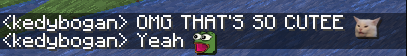
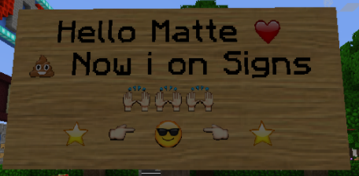

# Emoji in the chat

## What are they?

Emojis are actually just a textured unicode symbol. 

## Steps?

We'll start with preparing folder and file, then we'll edit the default.json file. After these we will find a plugin that converts texts to different text like it: 

%emoji\_1% -&gt; [❤️](https://www.google.com/url?sa=t&rct=j&q=&esrc=s&source=web&cd=&ved=2ahUKEwjV-6uy2cnuAhVRyxoKHZvnArUQFjAMegQICBAC&url=https%3A%2F%2Femojipedia.org%2Fred-heart%2F&usg=AOvVaw2iTHkylfMQmgNvpAEHugje)



## Add your emoji texture to Oraxen

That's easiest step just draw your .png file to Oraxen's texture folder 

It location must be;      Oraxen/Textures/emojihere.png

## S\) Folder and a json file

We prepared that folder and file in the Custom HUDs document but If you didn't interested with it, I'll show you again how to do, If you're prepared these before skip the steps that have **S\)** in its title. Also If you prepared default.json before, please don't change old ones, just try to type new character, find a unicode from Google and copy a sample that i give before, and edit it with your new unicode.  

We need **font** folder and **default.json** file.

Font folder's name must be just **font, default.json** is same too.

## S\) Font folder

As i said, font folder name must be just **font** and its file location is also important too.

Here is the its location:


## S\) default.json file



It's the same template of Custom HUDs document. There is just few changes,

Change the texture name.

Edit **ascent** and **height.**

You can change unicode too, I'll explain more now.

```text
{
    "providers": [
        {
            "type": "bitmap",
            "file": "laughemoji.png",
            "ascent": 9,
            "height": 12,
            "chars": ["\u2E95"]
        },
        {
            "type": "bitmap",
            "file": "sademoji.png",
            "ascent": 9,
            "height": 12,
            "chars": ["\u2EB1"]
        }

    ]
}


```

### What should you edit?

Firstly, change the "file" with what's the emoji file name. Texture and with its same name what in default.json name must be included in textures folder of Oraxen and please don't type the its location so;

laughemoji.png instead of textures/laughemoji.png

Edit the ascent and height values, It might be ascent: 9 height: 12

Don't forget ascent and height depends on texture size.

You might need new unicode If you use these before. You need one different unicode per one emoji If you will make new emoji you have to find new unicode. You can find easily from Google. Copy it as \u2EB1 and paste it to _"chars": \["here"\]_

## Find its symbol

Copy \( _chars": \["here"\] \)_ here section so unicode and just google it!


Don't lose that symbol you'll need it.

## Find a emoji plugin that makes macros

I found one for you [click here ](https://www.spigotmc.org/resources/basicexpressions-turns-expressions-into-emoticons.58767/)to visit plugin's Spigot link.

I didn't used it due to I don't know how its config but It's same/similar with all that types plugins find its macros in config and change its symbol to your unicode symbol.

### Configuration and setting emoji macros

%cloud% = ☁               Add it as your style so for example:        **%laughemoji% = ⺕**

## It works now!


Just type it in game It's depends on your emoji plugin If I would type a text with emoji in game that would be that:

_\[Owner\] kedybogan:_ Oraxen is so cool and there is a emoji %laughemoji%

Macro_\(%laughemoji%\)_ must be converted to your symbol and your symbol looks must textured with your emoji texture

## Cool tips

Also you can use them in EVERYWHERE that supports unicode symbols. For example using in signs you don't need any plugins just paste the symbol, or you can use macro plugin too for typing %laughemoji% instead of typing **⺕** But macro plugin for **signs** is hard to find I don't recommend and It's unnecessary I think



