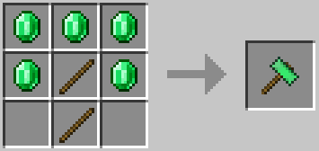
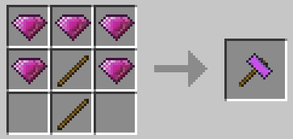
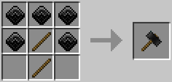
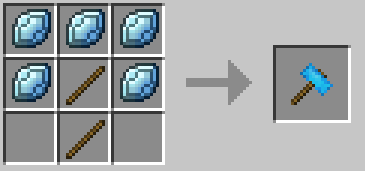
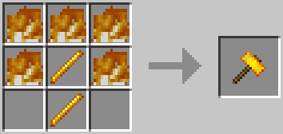

# Default items

## Armors

## Blocks

## Hats

## Items

## Mystical weapons

## Other weapons

## Other tools

## Hammers

Hammers are very special pickaxes capable of mining several blocks at the same time. Legend says that they were invented by Notch but he didn't have time to add them so he only drew them into the anvil repair interface.

### **Emerald Hammer**

The most basic hammer you can find is the **Emerald Hammer**, it mines a square of 3 blocks per 3 blocks, this is cool in order to start but definitively not the best you can get.

### Amethyst Hammer

Unlike the Emerald Hammer, the **Amethyst Hammer** mines a square of 3 blocks per 3 blocks too but with a depth of two blocks.

### Onyx Hammer

Take the Amethyst Hammer, improve it and you've got the **Onyx Hammer**. It can break more blocks than the Amethyst Hammer because it has a big durability.

### Orax Hammer

Compared to his brothers, the **Orax Hammer** is a god like hammer : it can mine a really big square with a depth of two blocks.

### Fire Hammer

The **Fire Hammer** mines like a basic hammer \(3 blocks per 3 blocks, depth of 1\) but it actually melts ores instantly! If you mine iron ore for example you'll immediatly get rewarded with iron ingots ...and it stacks with fortune!

